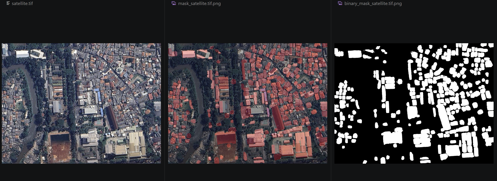

# YoloSAM-SatelliteImage-Detection-Segmentation



A comprehensive project for satellite image detection and segmentation using YOLO (You Only Look Once) Oriented Bounding Box (OBB) models and Segment Anything Model (SAM) for geospatial data processing.

## Description

This project provides tools for converting geospatial annotations (from AnyLabeling and GeoJSON formats) to YOLO OBB format, fine-tuning YOLO OBB models, and performing detection and segmentation on satellite images. It includes data augmentation, visualization tools, and a complete pipeline for building and testing models on geospatial datasets.

## Features

- **Data Conversion Tools**: Convert AnyLabeling JSON and GeoJSON annotations to YOLO OBB format
- **Data Augmentation**: Apply various augmentations to increase dataset diversity
- **Model Fine-tuning**: Fine-tune YOLO OBB models on custom geospatial datasets
- **Detection and Segmentation**: Use trained models for object detection and SAM for segmentation
- **Visualization**: Interactive UI tools for viewing annotations and results
- **Geospatial Processing**: Built-in support for geospatial data formats and libraries
- **Jupyter Notebook Integration**: Test and demonstrate models in interactive notebooks

## Prerequisites

Before installing, ensure you have the following:

- **Operating System**: Windows 10/11, macOS, or Linux
- **Conda Environment**: Miniconda or Anaconda installed
- **Git**: For cloning the repository (optional)
- **GPU**: NVIDIA GPU with CUDA support (recommended for training)

## Installation

### Step 1: Install Miniconda or Anaconda

If you don't have Conda installed, download and install Miniconda from [here](https://docs.conda.io/en/latest/miniconda.html) or Anaconda from [here](https://www.anaconda.com/products/distribution).

### Step 2: Clone or Download the Repository

Clone the repository using Git:

```bash
git clone https://github.com/rizkiprats/YoloSAM-SatelliteImage-Detection-Segmentation.git
cd YoloSAM-SatelliteImage-Detection-Segmentation
```

Or download the ZIP file and extract it to your desired location.

### Step 3: Create Conda Environment

Create the Conda environment using the provided `environment.yml` file:

```bash
conda env create -f environment.yml
```

This will create a new Conda environment named `yolo` with all required dependencies.

### Step 4: Activate the Environment

Activate the newly created environment:

```bash
conda activate yolo
```

### Step 5: Verify Installation

Verify that the environment is set up correctly by checking Python and key packages:

```bash
python --version
python -c "import geopandas, rasterio, torch; print('All key packages imported successfully')"
```

## Usage

### Data Preparation

1. **Convert AnyLabeling Annotations**:
   - Use `convert_anylabeling_to_yolo_obb_original.py` for basic conversion
   - Use `convert_anylabeling_to_yolo_obb_augmentation.py` for conversion with data augmentation

2. **Convert GeoJSON Annotations**:
   - Use `geojson_to_yolo_obb.py` to convert GeoJSON files to YOLO OBB format

3. **View Annotations**:
   - Run `show_annotations_ui.py` to visualize annotations interactively

### Model Training

1. **Fine-tune YOLO OBB Model**:
   ```bash
   python FinetuneYoloOBB.py
   ```

2. **Training Configuration**:
   - Modify the dataset path in `Jakarta_Building_Tree_YOLO_OBB_Dataset/dataset.yaml`
   - Adjust training parameters in the fine-tuning script

### Testing and Inference

1. **Run the Test Notebook**:
   - Open `TestDetectionYoloOBBSAM.ipynb` in Jupyter
   - Follow the cells to test detection and segmentation

2. **Command Line Testing**:
   - Use the provided scripts for batch processing

## Dataset

The project includes sample datasets:

- **Jakarta_Building_Anylabeling/**: Raw AnyLabeling JSON annotations
- **Jakarta_Building_GeoJSON_Data/**: GeoJSON format annotations
- **Jakarta_Building_Tree_YOLO_OBB_Dataset/**: Processed YOLO OBB dataset with train/val/test splits

### Dataset Structure

```
Jakarta_Building_Tree_YOLO_OBB_Dataset/
├── classes.txt          # Class names
├── dataset.yaml         # Dataset configuration for YOLO
├── images/              # Image files
├── labels/              # YOLO OBB label files
├── train/               # Training split
├── val/                 # Validation split
└── test/                # Test split
```

## Training

### Fine-tuning YOLO OBB

1. Prepare your dataset in YOLO OBB format
2. Update `dataset.yaml` with correct paths and class information
3. Run the fine-tuning script:

```bash
python FinetuneYoloOBB.py
```

### Training Parameters

- Model: YOLO11x-OBB (pre-trained weights available)
- Dataset: Custom geospatial dataset
- Augmentation: Configurable data augmentation
- Output: Trained model weights saved in `runs/obb/`

## Testing

### Using Jupyter Notebook

1. Launch Jupyter:
   ```bash
   jupyter notebook
   ```

2. Open `TestDetectionYoloOBBSAM.ipynb`
3. Run cells sequentially to:
   - Load models
   - Perform inference
   - Visualize results

### Model Weights

- `yolo11x-obb.pt`: Pre-trained YOLO OBB model
- `sam2.1_b.pt`: Segment Anything Model weights
- `best train3.pt`: Fine-tuned model weights

## Project Structure

```
YoloSAM-SatelliteImage-Detection-Segmentation/
├── environment.yml                          # Conda environment configuration
├── FinetuneYoloOBB.py                       # YOLO OBB fine-tuning script
├── convert_anylabeling_to_yolo_obb_*.py     # Data conversion scripts
├── geojson_to_yolo_obb*.py                  # GeoJSON conversion scripts
├── show_annotations_ui.py                   # Annotation visualization
├── TestDetectionYoloOBBSAM.ipynb            # Testing notebook
├── *.pt                                     # Model weights
├── Jakarta_Building_Anylabeling/            # Raw annotations
├── Jakarta_Building_GeoJSON_Data/           # GeoJSON data
├── Jakarta_Building_Tree_YOLO_OBB_Dataset/  # Processed dataset
└── runs/                                    # Training outputs
```

## Contributing

1. Fork the repository
2. Create a feature branch (`git checkout -b feature/AmazingFeature`)
3. Commit your changes (`git commit -m 'Add some AmazingFeature'`)
4. Push to the branch (`git push origin feature/AmazingFeature`)
5. Open a Pull Request

## Acknowledgments

- YOLO models from Ultralytics
- Segment Anything Model from Meta AI
- Geospatial libraries: GeoPandas, Rasterio, Shapely
- UI components: Folium, Leafmap, IPyWidgets

## Support

For questions or issues, please open an issue on the GitHub repository or contact the maintainers.